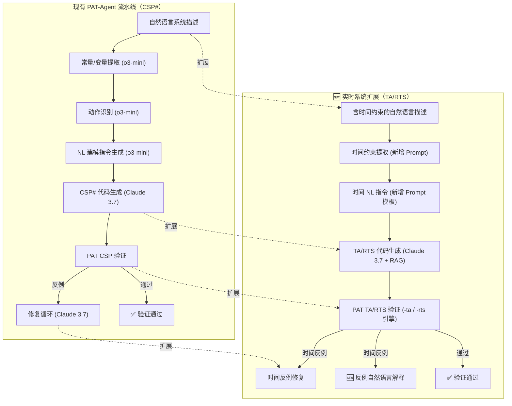

# PAT-Agent-RT：面向实时系统的 LLM 辅助形式化验证扩展

> **Stage 2 课程作业 — 方向 C：试点解决方案（Pilot Solution）**
>
> 基于 PAT-Agent (ASE 2025) 开源仓库，向实时系统（Timed Automata / RTS）方向扩展

---

## 一、背景与动机

### 1.1 Stage 1 核心发现

在 Stage 1 技术调查报告《人机协同的系统模型检测：AI 辅助的性质生成与反例理解》中，识别出以下关键研究缺口：

- **TCTL/MTL 实时逻辑支持薄弱**：现有 LLM 辅助形式化验证工具主要支持 LTL/可达性/死锁，缺乏对实时逻辑（TCTL、MTL）的系统支持
- **时间自动机模型生成空白**：无一工具能从自然语言自动生成时间自动机模型
- **反例自然语言解释缺失**：现有工具大多仅输出反例轨迹，未提供人类可读的实时反例解释

### 1.2 PAT-Agent 基础

PAT-Agent 是 ASE 2025 录用的论文项目，实现了基于双 LLM 协作的形式化模型自动生成与修复流水线：

```
自然语言描述 → 规划LLM(o3-mini) → NL指令 → 代码生成LLM(Claude) → PAT验证 → 修复循环
```

- **支持性质**：LTL、可达性、死锁检测
- **目标语言**：CSP#（通讯顺序进程）
- **数据集**：40 个离散并发系统
- **核心局限**：不支持实时系统（TCTL、时间自动机、时钟变量）

### 1.3 关键发现：PAT 已内置实时引擎

在深入分析 PAT 模型检测器代码后，发现 PAT 已内置以下实时相关模块，**但 PAT-Agent 流水线完全未使用**：

| 模块 | 扩展名 | 关键语法 | 当前状态 |
|------|--------|----------|----------|
| **TA**（Timed Automata） | `.ta` | `clock`、`TimedAutomaton`、`inv`、`urgent`、`committed`、`refines<T>` | ❌ 未使用 |
| **RTS**（Real-Time Systems） | `.rts` | `Wait`、`timeout`、`deadline`、`within`、`tock` | ❌ 未使用 |
| **PRTS**（Probabilistic RTS） | — | 概率+实时 | ❌ 未使用 |

**这意味着底层验证能力已经就绪，只需扩展上层 LLM 流水线！**

---

## 二、总体架构设计

### 2.1 扩展架构图



### 2.2 流水线阶段对比

| 阶段 | 原有（CSP#） | 扩展后（TA/RTS） |
|------|-------------|-------------------|
| ① 信息提取 | 常量 + 变量 | 常量 + 变量 + **时钟** + **时间约束** |
| ② 动作识别 | 状态转移 | 状态转移 + **时钟重置** + **不变量** |
| ③ NL 指令 | CSP# 注释 | TA/RTS 注释（含时间语义） |
| ④ 代码生成 | CSP# 模型 | TA 自动机 / RTS 进程 |
| ⑤ 验证 | `-csp` 引擎 | `-ta` / `-rts` 引擎 |
| ⑥ 修复 | 逻辑反例修复 | 逻辑 + **时间**反例修复 |
| ⑦ 解释 | ❌ 无 | 🆕 **时间反例 NL 解释** |

---

## 三、六大具体任务

### 任务 1：扩展数据集格式

**目标**：在现有 JSON schema 中增加实时相关字段，支持 TA 和 RTS 模型

**新增字段**：

```json
{
    "modelName": "thermostat_controller",
    "modelType": "timed",
    "targetModule": "ta",
    "modelDesc": "A smart thermostat that controls a heater...",
    "clocks": [
        {"name": "t", "description": "global system clock"},
        {"name": "x", "description": "local timer for heater response"}
    ],
    "timeConstraints": [
        {
            "description": "heater must turn off within 3 seconds after overtemperature",
            "bound": 3,
            "unit": "seconds",
            "type": "upper_bound"
        }
    ],
    "subsystems": [
        {
            "name": "Heater",
            "description": "The heater can be on or off. When temperature exceeds 80°C, heater must turn off within 3 seconds.",
            "urgentStates": ["overheat_detected"],
            "invariants": [
                {"state": "heating", "invariant": "x <= 10", "description": "cannot heat continuously for more than 10s"}
            ]
        }
    ],
    "assertions": [
        {
            "assertionType": "tctl",
            "tctlFormula": "A[] (overheat -> A<>(<=3) heater_off)",
            "naturalLanguage": "一旦过热，加热器必须在3秒内关闭",
            "assertionTruth": "Valid",
            "component": "",
            "editingFinished": false
        },
        {
            "assertionType": "reachability",
            "component": "",
            "stateName": "safe_temp",
            "reachabilityType": "customize",
            "customDescription": "temperature eventually returns to safe range within 10 seconds",
            "conditions": [],
            "editingFinished": true,
            "assertionTruth": "Valid"
        },
        {
            "assertionType": "deadlock-free",
            "component": "",
            "assertionTruth": "Valid"
        }
    ]
}
```

**涉及文件**：`Datasets/PAT-RT.json`（包含 3 个实时案例）

---

### 任务 2：新增时间约束提取 Prompt

**目标**：在 `gen_const_and_vars()` 之后增加 `gen_time_constraints()`，利用 o3-mini 从自然语言中提取时间相关信息

**实现位置**：`Automated_Pipelines/Full_Pipeline/pipeline.py`

**Prompt 设计**：

```python
def gen_time_constraints(structuredData):
    """
    🆕 从自然语言中提取时间约束、时钟变量、紧急状态和不变量
    """
    prompt = f"""As an expert in real-time systems and timed automata, 
    analyze the following system description and extract ALL timing-related information.

    System Description: {structuredData['modelDesc']}

    Processes:
    {json.dumps(structuredData['subsystems'], indent=2)}

    Extract the following:
    1. **Clock Variables**: All clocks needed (global clocks, local timers, stopwatches)
    2. **Timing Bounds**: Deadlines, timeouts, periods, response-time requirements
    3. **Urgent/Committed States**: States where time cannot progress
    4. **State Invariants**: Time bounds on how long a state can be active
    5. **Clock Resets**: Which actions reset which clocks

    Output in this JSON format:
    {{
        "clocks": [
            {{"name": "t", "type": "global", "description": "global system clock"}},
            {{"name": "x", "type": "local", "description": "timer for heater shutdown"}}
        ],
        "timeConstraints": [
            {{
                "description": "response within 3 seconds",
                "type": "upper_bound",
                "bound": 3,
                "trigger": "overheat detected",
                "response": "heater off"
            }}
        ],
        "urgentStates": [
            {{"state": "overheat_detected", "process": "Heater", "reason": "must respond immediately"}}
        ],
        "invariants": [
            {{"state": "heating", "process": "Heater", "condition": "x <= 10", "description": "max continuous heating 10s"}}
        ],
        "clockResets": [
            {{"action": "start_heating", "clock": "x", "resetTo": 0}}
        ]
    }}

    Requirements:
    - All numeric bounds must be integers or decimals with clear units
    - Clock names must be single lowercase letters or alphanumeric identifiers
    - Invariants must be expressed as comparisons (e.g., "x <= 10")
    - If no timing information exists, return empty arrays
    """
    # 调用 o3-mini，结果存入 history/time-constraints.json
```

---

### 任务 3：扩展 NL 指令生成

**目标**：修改 `gen_nl_instructions()` 和 `_process_assertions_for_nl_helper()`，使生成的 NL 指令能引导 Claude 生成 TA/RTS 代码

#### 3.1 新增 TA 模块的 NL 注释模板

```
// === Timed Automaton Definition ===
// Declare clocks: clock t; clock x;
// TimedAutomaton Heater() {
//     state Off {
//         inv: true;  // no time constraint
//     }
//     trans: Off -> Heating { event: start_heating; guard: temp < 80; reset: x := 0; }
//     state Heating {
//         inv: x <= 10;  // cannot heat continuously > 10s
//     }
//     trans: Heating -> Off { event: stop_heating; guard: x <= 10; }
// }
```

#### 3.2 新增 RTS 模块的 NL 注释模板

```
// === Real-Time System Definition ===
// Wait[3];  // wait 3 time units before proceeding
// event_chain() = a -> Wait[2] -> b -> Stop;
// with_timeout() = long_task() timeout[5] fallback();
// with_deadline() = task() deadline[10];
```

#### 3.3 新增 TCTL 断言的 NL 转译

将类 TCTL 断言转译为 PAT TA 支持的 LTL+时钟断言：

```python
def _process_timed_assertions(assertions_list):
    """
    🆕 将类 TCTL 断言转为 PAT 可验证的格式
    
    映射规则：
    - A[] (p → A<>(≤5) q)  →  #assert System |= [](p -> <>q);
    - E<>(≤10) goal         →  #assert System reaches goal;
    - A[] not deadlock       →  #assert System deadlockfree;
    """
```

**涉及文件**：
- `Automated_Pipelines/Full_Pipeline/pipeline.py` — `gen_nl_instructions()` 修改
- `Interface/templates/prompts.js` — 新增 `genTimeConstraintPrompt()` 等函数

---

### 任务 4：扩展代码生成与验证

**目标**：修改 `gen_code()` 和 `verify_code()`，使其能根据 `targetModule` 选择不同的生成路径和验证引擎

#### 4.1 代码生成分支

```python
def gen_code(structured_data, full_nl_prompt):
    model_type = structured_data.get('modelType', 'discrete')
    target_module = structured_data.get('targetModule', 'csp')
    
    # 🆕 选择语法参考文件
    if target_module == 'ta':
        syntax_file = './syntax-dataset-rt.json'
        rag_db = './database-rag-ta.json'
        syntax_section = 'ta_syntax'
    elif target_module == 'rts':
        syntax_file = './syntax-dataset-rt.json'
        rag_db = './database-rag-rts.json'
        syntax_section = 'rts_syntax'
    else:
        syntax_file = './syntax-dataset.json'
        rag_db = './database-rag-claude.json'
        syntax_section = None
    
    # ... 后续 RAG 和代码生成逻辑
```

#### 4.2 验证引擎分支

```python
def verify_code(structured_data, code_to_verify, ...):
    target_module = structured_data.get('targetModule', 'csp')
    
    # 🆕 根据目标模块选择 PAT 引擎
    if target_module == 'ta':
        engine_flag = '-ta'
    elif target_module == 'rts':
        engine_flag = '-rts'
    else:
        engine_flag = '-csp'
    
    command = ["mono", f"{root_path}/PAT.Console/Process-Analysis-Toolkit/PAT3.Console.exe",
               engine_flag, "-engine", "1", input_file, output_file]
```

#### 4.3 新增语法参考文件

创建 `syntax-dataset-rt.json`：

```json
{
    "ta_syntax": {
        "general_info": "PAT's Timed Automata module supports...",
        "clock_declaration": "clock x; clock y[4];",
        "automaton_structure": "TimedAutomaton Name(params) { state S { inv: condition; } trans: S -> T { event e; guard g; reset: x := 0; } }",
        "invariant": "inv: x <= 10;  // state invariant",
        "urgent_channel": "urgent channel ch;  // urgent synchronization",
        "committed_state": "committed state S { ... }  // no time delay allowed",
        "assertions": "#assert System reaches goal;",
        "pitfalls_rules": "1. Clocks must be declared before automata\n2. Invariants must be comparison expressions\n3. Clock resets use := assignment\n..."
    },
    "rts_syntax": {
        "general_info": "PAT's Real-Time System module supports...",
        "wait": "Wait[3];  // wait exactly 3 time units",
        "timeout": "P timeout[5] Q;  // if P not done in 5 units, run Q",
        "deadline": "P deadline[10];  // P must complete within 10 units",
        "within": "P within[10];  // P completes within 10 units",
        "tock": "tock  // special event for time passage (DO NOT use directly)",
        "pitfalls_rules": "1. Wait[0] equals Skip\n2. timeout/deadline bounds must be positive integers\n..."
    }
}
```

**涉及文件**：
- `Automated_Pipelines/Full_Pipeline/pipeline.py` — 多处修改
- `Automated_Pipelines/Full_Pipeline/syntax-dataset-rt.json` — 🆕
- `Automated_Pipelines/Full_Pipeline/database-rag-ta.json` — 🆕
- `Automated_Pipelines/Full_Pipeline/database-rag-rts.json` — 🆕

---

### 任务 5：🆕 时间反例自然语言解释

**目标**：这是 Stage 1 识别的核心缺口。实现将 PAT 输出的时间反例轨迹翻译为人类可读的自然语言解释。

**实现位置**：`pipeline.py` 新增 `_explain_timed_counterexample()` 函数

**设计**：

```python
def _explain_timed_counterexample(trace, clock_valuations, constraints, model_desc):
    """
    🆕 将时间反例轨迹翻译为自然语言解释
    
    输入示例:
      trace = [
          {"state": "Off", "time": 0.0, "clocks": {"t": 0, "x": 0}},
          {"state": "Heating", "time": 1.5, "clocks": {"t": 1.5, "x": 0}},
          {"state": "Overheat", "time": 2.3, "clocks": {"t": 2.3, "x": 0.8}},
          {"state": "Heating", "time": 5.4, "clocks": {"t": 5.4, "x": 3.9}}
      ]
      constraints = "heater must turn off within 3 seconds of overtemperature"
    
    输出:
      "验证失败：系统在时间 2.3 秒时检测到过热状态，但加热器直到 5.4 秒才关闭，
       共计延迟 3.1 秒，超出了 3.0 秒的安全约束。"
    """
    prompt = f"""You are an expert in real-time systems analysis. 
    Given the following timed counterexample trace, explain in clear natural 
    language what went wrong and why the timing constraint was violated.

    System: {model_desc}
    
    Counterexample trace (with clock values at each step):
    {json.dumps(trace, indent=2)}
    
    Violated constraint: {constraints}
    
    Please explain:
    1. What sequence of events happened
    2. At what time the violation occurred
    3. Why the timing constraint was not satisfied
    4. What should have happened instead (the expected behavior)
    
    Use specific time values from the trace. Be concise but informative.
    """
    
    return get_LLM_answers(prompt, ...)
```

**集成方式**：在 `verify_code()` 检测到反例时，自动调用此函数，将解释存入 `history/counterexample_explanations.json`

---

### 任务 6：构建小型实时案例库

**目标**：创建 3 个递进式实时案例，用于端到端可行性演示

#### 案例 1：智能温控器（Thermostat Controller）

| 属性 | 值 |
|------|---|
| 进程数 | 2（TemperatureSensor, Heater） |
| 时钟数 | 2（t 全局时钟, x 加热计时器） |
| 目标模块 | TA |
| 核心约束 | 过热后 3 秒内必须关闭加热器 |
| TCTL 断言 | `A[] (overheat → A<>(≤3) heater_off)` |

#### 案例 2：铁路道口控制器（Railroad Crossing）

| 属性 | 值 |
|------|---|
| 进程数 | 3（Train, Gate, Controller） |
| 时钟数 | 3（t, approach_timer, close_timer） |
| 目标模块 | TA |
| 核心约束 | 列车接近后 5 秒内闸门必须完全关闭；闸门关闭后列车才能通过 |
| TCTL 断言 | `A[] (train_approaching → A<>(≤5) gate_closed)` |
| 额外断言 | 死锁检测、安全性（train_crossing → gate_closed） |

#### 案例 3：心跳监测协议（Heartbeat Monitor）

| 属性 | 值 |
|------|---|
| 进程数 | 2（Sender, Monitor） |
| 时钟数 | 1（t） |
| 目标模块 | RTS |
| 核心约束 | 发送方每 2 秒发送心跳；监控方若 5 秒内未收到心跳则报警 |
| 关键语法 | `Wait[2]`、`timeout[5]` |

---

## 四、修改文件清单

```
PAT-Agent/
├── Datasets/
│   └── PAT-RT.json                              # 🆕 实时案例数据集（3个案例）
├── Automated_Pipelines/Full_Pipeline/
│   ├── pipeline.py                              # ✏️ 修改
│   │   ├── + gen_time_constraints()             #   🆕 时间约束提取
│   │   ├── ~ gen_nl_instructions()              #   扩展 TA/RTS NL 指令
│   │   ├── ~ _process_assertions_for_nl_helper()#   扩展 TCTL 断言处理
│   │   ├── ~ gen_code()                         #   分支：CSP / TA / RTS
│   │   ├── ~ verify_code()                      #   分支：-csp / -ta / -rts
│   │   ├── ~ _process_mismatch_traces()         #   扩展时间反例
│   │   └── + _explain_timed_counterexample()    #   🆕 反例 NL 解释
│   ├── pipeline_rt.py                           # 🆕 实时流水线独立入口
│   ├── syntax-dataset-rt.json                   # 🆕 TA/RTS 语法参考
│   ├── database-rag-ta.json                     # 🆕 TA 示例 RAG 库
│   └── database-rag-rts.json                    # 🆕 RTS 示例 RAG 库
├── Interface/
│   ├── templates/
│   │   ├── prompts.js                           # ✏️ 新增实时 prompt 函数
│   │   ├── codegen.html                         # ✏️ TA/RTS 代码高亮
│   │   └── index.html                           # ✏️ 新增 targetModule 选择
│   └── server.py                                # ✏️ 新增 TA/RTS 验证端点
├── Experiments_Demo/
│   ├── generated_code/
│   │   ├── thermostat/                          # 🆕 温控器演示
│   │   │   ├── 0.csp / 0.ta                     #   初始生成
│   │   │   ├── refine_round_1/                  #   修复过程
│   │   │   └── verifiedCode.ta                  #   验证通过版本
│   │   ├── railroad/                            # 🆕 铁路道口演示
│   │   └── heartbeat/                           # 🆕 心跳监测演示
│   └── run_time_record/
│       ├── thermostat.json                      # 🆕 运行时间记录
│       ├── railroad.json
│       └── heartbeat.json
└── PAT-Agent-RT_技术方案.md                      # 📄 本文档
```

图例：🆕 新建文件 | ✏️ 修改现有文件 | `+` 新增函数 | `~` 修改函数

---

## 五、预估工作量和里程碑

| 阶段 | 内容 | 预估时间 | 产出物 |
|------|------|----------|--------|
| **Phase 1** | 数据集扩展 + 3 个实时案例设计 | 1-2 天 | `PAT-RT.json`、案例规格文档 |
| **Phase 2** | 修改 pipeline.py（时间约束提取 + TA/RTS 代码生成） | 2-3 天 | 可运行的 `pipeline_rt.py` |
| **Phase 3** | 扩展验证引擎（PAT TA/RTS 命令行对接）+ 语法参考 | 1 天 | `syntax-dataset-rt.json`、验证通过 |
| **Phase 4** | 时间反例 NL 解释模块 | 1-2 天 | `_explain_timed_counterexample()` |
| **Phase 5** | 端到端测试 + 对比实验（vs 纯人工编写） | 2-3 天 | 实验数据、对比表格 |
| **Phase 6** | 撰写 Stage 2 报告 | 3-5 天 | 完整课程报告 |
| **总计** | | **10-16 天** | |

---

## 六、风险与应对

| 风险 | 概率 | 影响 | 应对策略 |
|------|------|------|----------|
| PAT TA 引擎对 LLM 生成的语法容错低 | 中 | 高 | 增加语法验证步骤；丰富 RAG 库示例 |
| LLM 对时间推理不够精确 | 高 | 中 | 依赖 PAT 验证器仲裁；多次修复循环 |
| TCTL 性质无法直接映射到 PAT LTL | 中 | 中 | 只选取可映射的子集（A[], E<>, A<>） |
| 时间反例轨迹解析困难 | 中 | 低 | 先用 LLM 辅助解析，再人工校验 |

---

## 七、预期贡献

1. **首个 LLM+时间自动机 端到端流水线**：从自然语言直接生成可验证的 TA/RTS 模型
2. **TCTL 自然语言性质生成**：支持类 TCTL 断言（通过 PAT LTL+时钟约束表达）
3. **时间反例自然语言解释**：将形式化反例轨迹翻译为人类可读的实时分析
4. **3 个完整演示案例**：覆盖 TA 和 RTS 模块，证明扩展可行性
5. **对比实验数据**：LLM 辅助 vs 纯人工编写的时间/正确率对比

---

## 八、参考资料

- Zuo et al., "PAT-Agent: Autoformalization for Model Checking", ASE 2025
- PAT 官方文档：`PAT.Console/Process-Analysis-Toolkit/Docs/`
- PAT TA 模块：`Modules/TA/` — Timed Automata 语法定义
- PAT RTS 模块：`Modules/RTS/` — Real-Time Systems 语法定义
- Alur & Dill, "A Theory of Timed Automata", 1994
- UPPAAL 工具 (www.uppaal.org) — 可选的验证后端替代
